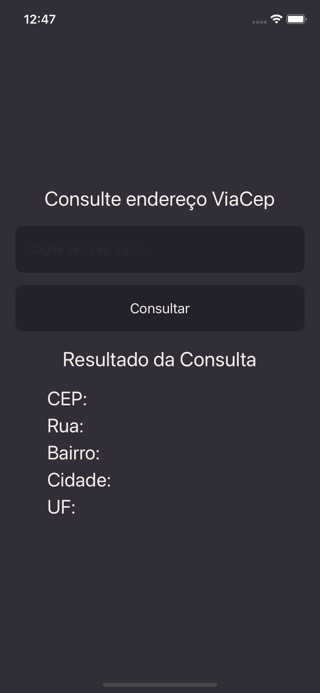
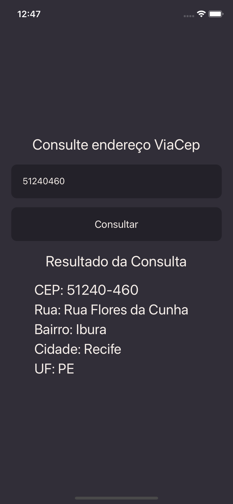

<h1 align="center">
  Consulta Via Cep
</h1>
 
# Indice

- [Sobre](#-sobre)
- [Tecnologias Utilizadas](#-tecnologias-utilizadas)
- [Como baixar o projeto](#-como-baixar-o-projeto)


## ☀️ Sobre

o projeto mobile api via cep foi feito para colocar em prática o que aprendi, consumindo api do **ViaCep** para procurar endedereços através do Cep.
 
<h1 align="center">
     
      
        
</h1>

 
## 💻 Tecnologias utilizadas

- [React Native](https://reactnative.dev/)

- [Typescript](https://www.typescriptlang.org/)
- [Styled Components](https://styled-components.com) 
- [Axios](https://github.com/axios/axios)
 
 ---
 ## 📁 Como baixar o projeto

```bash
# clonar repositório
$ git clone https://github.com/wagneer-nasc/viacep-api.git

# Entrar no diretório
$ cd viacepapi

# Instalar as dependencias
$ yarn install
$ cd ios pod install

# inicar o projeto
$ yarn ios para quem está com o emulador IOS
$ yarn run android para quem está com emulador Android

```
### 😁  Contato , Dúvidas .
- Linkedin [Wagner Nascimento](https://www.linkedin.com/in/wagner-nascimento-8824b717b/)
